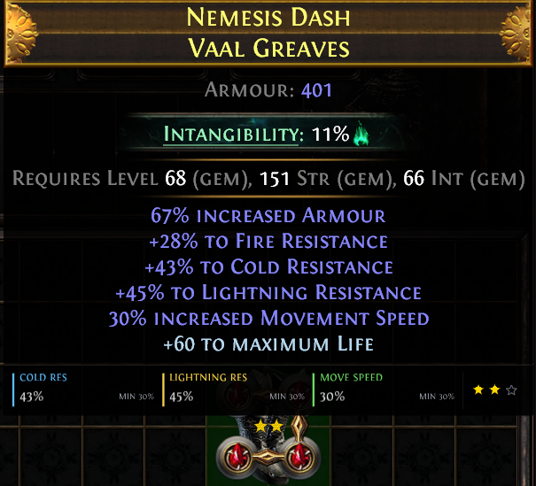
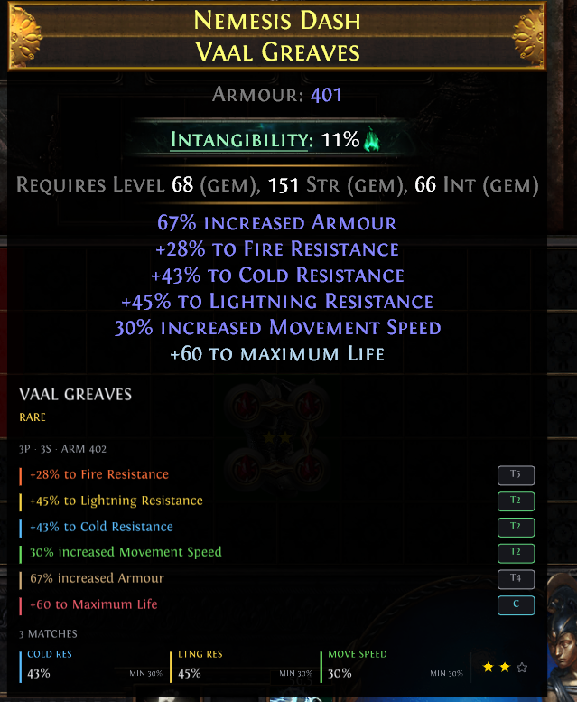
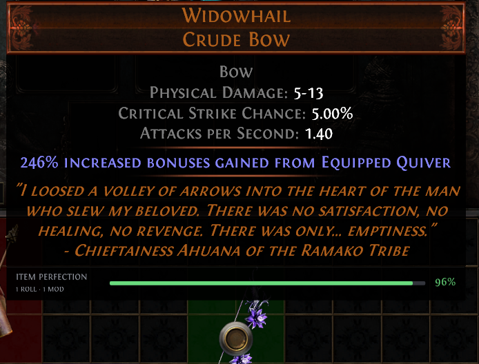
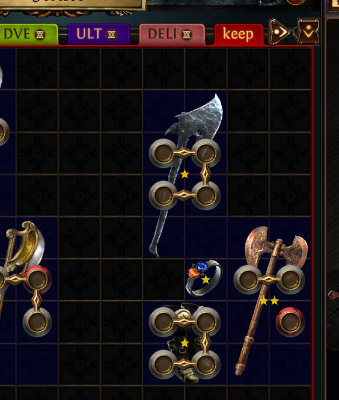

# LootLens

item analysis plugin that helps you quickly identify promising equipment using configurable stat thresholds, modifier information, star ratings, and unique item roll perfection percentages.

## Features

* minimal interface attached directly beneath item tooltips
* compact analysis with an expanded full-analysis view
* configurable gold-star loot ratings for every equipment slot
* special valuable modifiers highlighted with red stars, like tailwind.
* ratings on qualifying items in the visible stash tab
* unique-item perfection scores based on variable modifier rolls
* affix tiers with crafted and implicit modifier badges
* phys/ele/total wep dps calcs

## Compact Item Analysis

A condensed rating bar displays qualifying stats, configured thresholds, and the resulting star rating without covering the item tooltip.

## Full Item Analysis

Hold the configured full-analysis key while hovering over an item to display modifier tiers, crafted modifiers, defenses, weapon statistics, and qualifying loot rating stats.

## Unique-Item Perfection

Unique items receive a perfection percentage calculated from their variable modifier rolls. Fixed modifiers are excluded so they do not distort the result.

## Persistent Stash Ratings

Qualifying items in the currently visible stash tab can display persistent stars, making valuable items easier to identify without hovering over each one.

## Controls

* Hover over an item to display the compact LootLens analysis.
* Hold the configured full-analysis key to display the expanded modifier view.
* The full-analysis key can be changed in the LootLens settings.
* Stash and equipped-item behavior can also be configured in the settings.

## Loot Ratings

LootLens evaluates items using the thresholds you configure for each equipment slot.

The item receives the highest star level whose required number of qualifying stats has been reached. A threshold of `0` disables that particular stat.

These ratings are intended as a fast and customizable loot-triage system. They are not automatic price checks and do not guarantee an item’s market value.

## Credits

Made by **woogo**.

Please feel free to message me on Discord with any errors, feedback, or suggestions.
