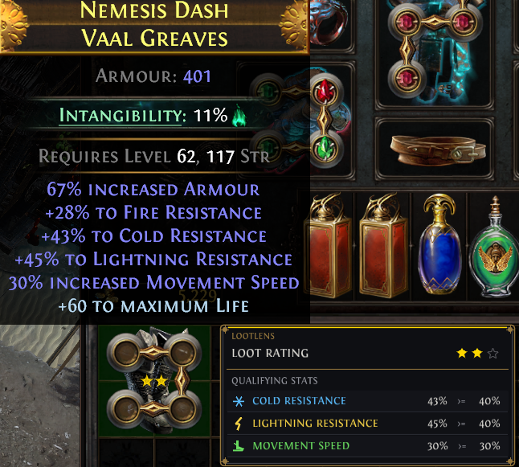
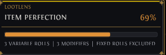
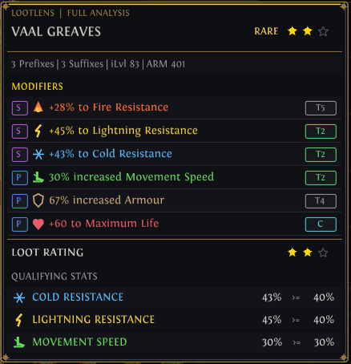
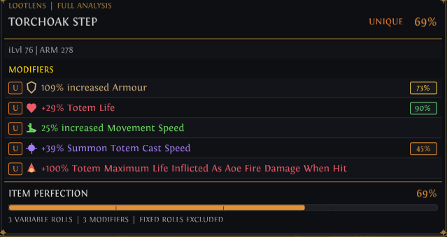
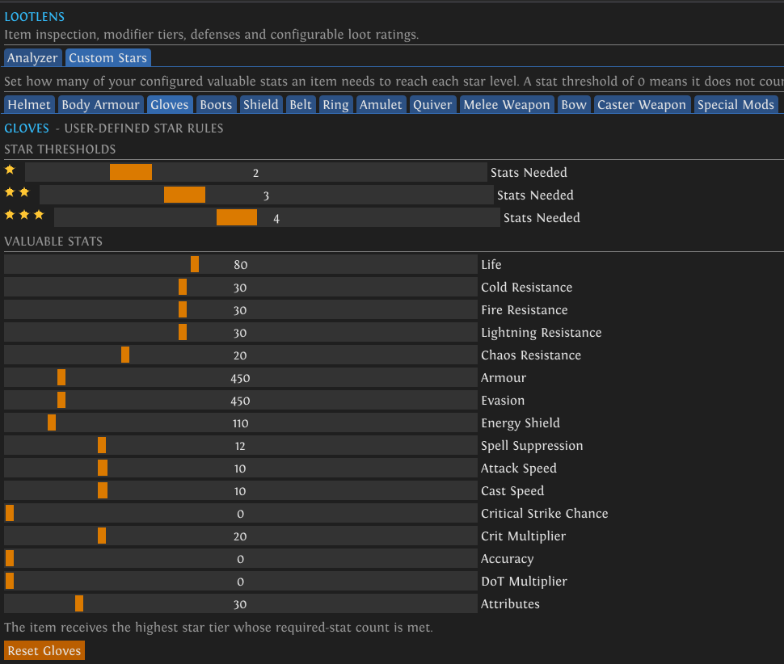
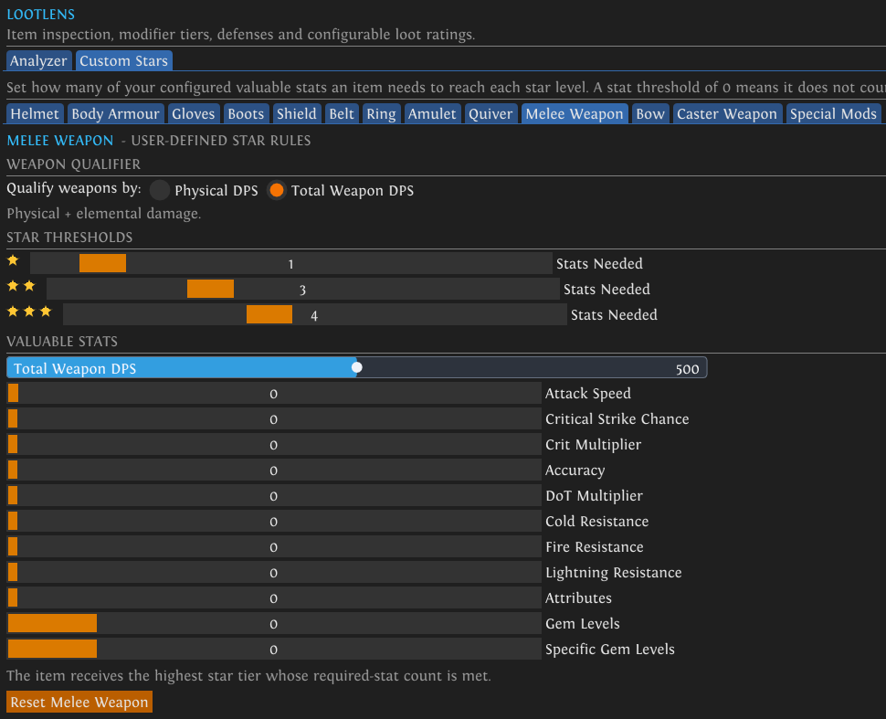

# LootLens

LootLens is an item-analysis plugin for ExileAPI. It was made in place of the older InventoryItemAnalyzer plugin from many years ago. It helps identify valuable equipment through configurable loot ratings, modifier analysis, affix tiers, defensive totals, special modifiers, and unique item roll perfection.

## Features

* Polished compact and full item analyzers
* User-configurable gold-star loot ratings
* Special valuable modifiers marked with red stars
* Inventory, stash, and equipped-item hovering
* Unique-item roll perfection percentages
* Real affix tiers and crafted-modifier badges
* Prefix and suffix identification
* Color-coded stats and modifier icons
* Armour, evasion, and energy shield totals
* Physical DPS and total weapon DPS evaluation
* Individual rules for every equipment slot
* Configurable appearance, thresholds, and keybinds

## Compact Hover Rating

LootLens displays a compact rating card beside hovered inventory and stash items. It shows the item’s star rating and every stat that met your configured thresholds without replacing the original item tooltip.

## Unique Item Perfection

Unique items receive an Item Perfection score based on their variable rolls. Fixed rolls are excluded so the percentage reflects only values that could have rolled differently.

## Full Rare Item Analysis

The full analyzer organizes modifiers with color-coded icons, prefix and suffix badges, affix tiers, and crafted-modifier indicators. The lower panel explains the item’s loot rating by showing every qualifying stat and its configured target.

## Full Unique Item Analysis

For unique items, LootLens scores each variable modifier within its possible range and combines those rolls into one overall Item Perfection percentage. Individual percentage badges make strong and weak rolls easy to identify.

## Configurable Star Rules

Every equipment slot has its own configurable rating rules. Choose how many valuable stats an item needs for each star level, then adjust the life, resistance, defense, offense, attribute, and utility thresholds for your build.

## Weapon Evaluation

Weapons have dedicated evaluation controls, including Physical DPS and Total Weapon DPS modes. Additional rules cover attack speed, critical stats, accuracy, damage over time, resistances, attributes, and gem levels.

## Using LootLens

* Hover over a supported item in your inventory or stash to display its analysis.
* Enable the compact view for a smaller loot-rating card.
* Hold your configured Full Analyzer key to display the complete modifier breakdown.
* Open **Custom Stars** in the plugin settings to configure rating rules for each equipment slot.
* Use the **Special Mods** tab to configure modifiers that award an additional red star.
* Unique items automatically display Item Perfection when variable roll ranges are available.

## Loot Ratings

LootLens awards one, two, or three gold stars according to your configured rules. An item receives the highest star level whose required number of valuable stats is met.

Red stars are separate from the normal loot rating and indicate the presence of a configured special modifier, such as Tailwind or Onslaught-related effects.

## Creator

Made by **woogo** ❤

Please feel free to message me on Discord with any errors, compatibility problems, or suggestions.

## Status

This is the current stable release of LootLens.
